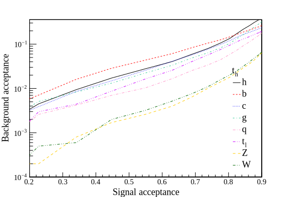
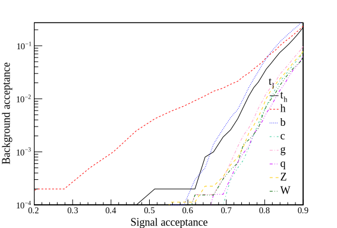
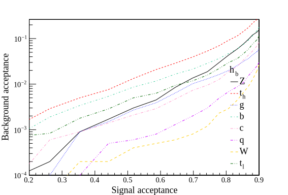
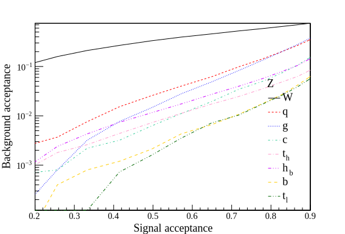
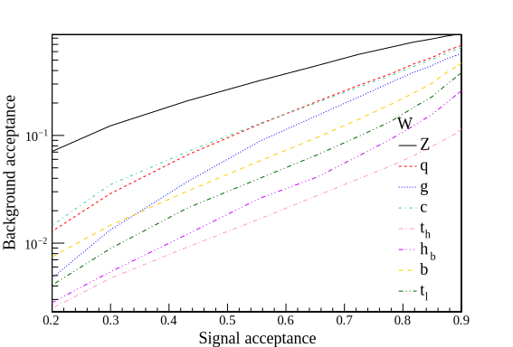
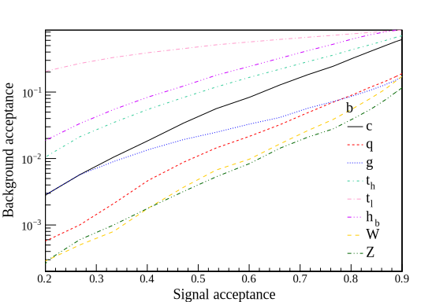

# Standard Model Acceptances

Signal and background acceptances for a 100 TeV collider with a CMS-like detector.
All particles are boosted with transverse momenta between 1000 GeV and 1500 GeV.

## Top

### Hadronic

### Leptonic

## Higgs

## Z boson

## W boson (hadronic)

## Bottom

